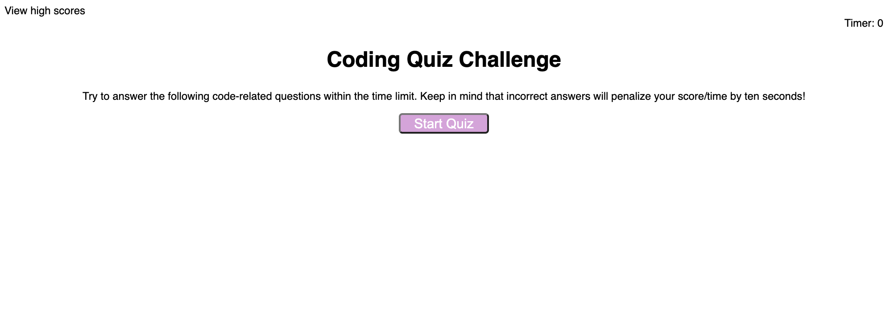
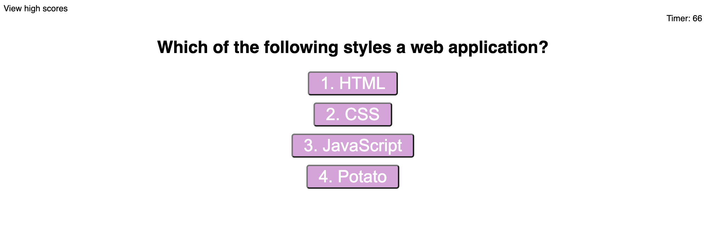
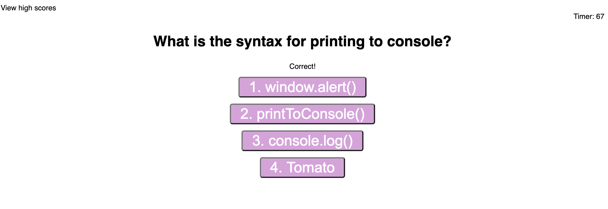
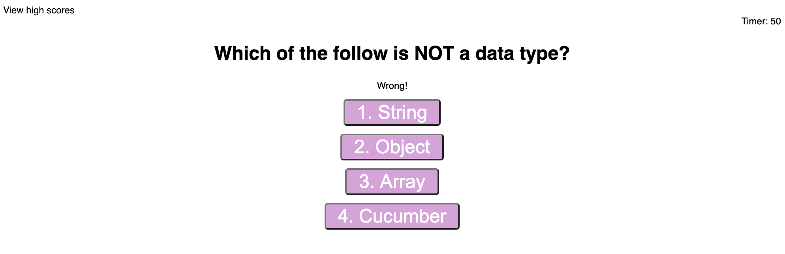
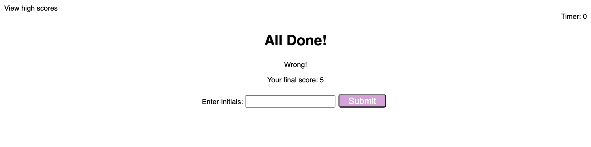
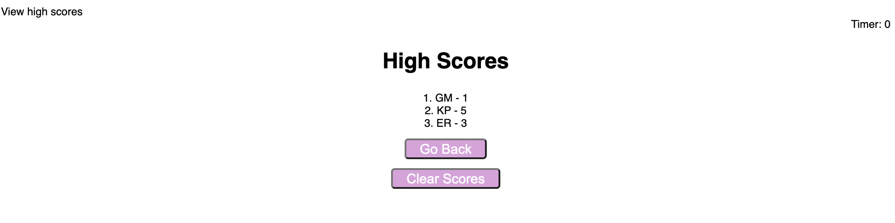

Code Quiz

Installation:

Go to the following link to take The Code Quiz:
(https://ginomaglaqueucla.github.io/code-quiz-gm20/)

If accessing locally, clone repository from (https://github.com/ginomaglaqueucla/code-quiz-gm20.git) to local directory on computer. Open index.html through your browser and site will come up.

Usage:

The Code Quiz is a web application that prompts the user with coding question using with dynamic javascript. User will answer questions accordingly and be displayed with a correct/wrong prompt on the page. When the time is up or if user reaches end of the questions list, the page will display the user's score and ask for user's initials to submit the score onto the quiz leaderboard. The Code Quiz leaderboards will be shown dynamically onto the next page or if user ever clicks on the "View high scores" link. The leaderboard shows all the submitted scores with respective initals. The user may then "Go Back" to the main page or "Clear Storage" (clear the leaderboard).

Usage (Screenshots):
Main Page

Questions

Correct Answer

Wrong Answer

Submit Score

Leaderboard

Credits Changes/Commits by: ginomaglaqueucla - (https://github.com/ginomaglaqueucla/code-quiz-gm20.git)

License MIT License

Copyright (c) 2020 Gino Maglaque

Permission is hereby granted, free of charge, to any person obtaining a copy of this software and associated documentation files (the "Software"), to deal in the Software without restriction, including without limitation the rights to use, copy, modify, merge, publish, distribute, sublicense, and/or sell copies of the Software, and to permit persons to whom the Software is furnished to do so, subject to the following conditions:

The above copyright notice and this permission notice shall be included in all copies or substantial portions of the Software.

THE SOFTWARE IS PROVIDED "AS IS", WITHOUT WARRANTY OF ANY KIND, EXPRESS OR IMPLIED, INCLUDING BUT NOT LIMITED TO THE WARRANTIES OF MERCHANTABILITY, FITNESS FOR A PARTICULAR PURPOSE AND NONINFRINGEMENT. IN NO EVENT SHALL THE AUTHORS OR COPYRIGHT HOLDERS BE LIABLE FOR ANY CLAIM, DAMAGES OR OTHER LIABILITY, WHETHER IN AN ACTION OF CONTRACT, TORT OR OTHERWISE, ARISING FROM, OUT OF OR IN CONNECTION WITH THE SOFTWARE OR THE USE OR OTHER DEALINGS IN THE SOFTWARE.